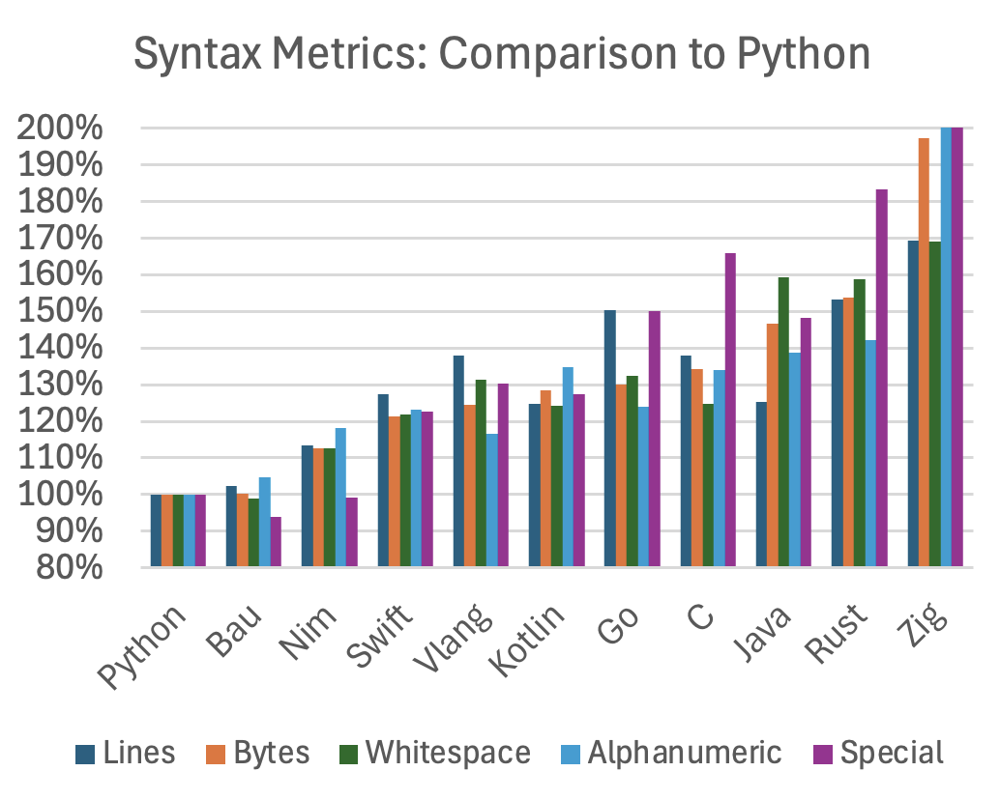

# Concise Syntax

Bau attempts to be easy to learn, with clear, simple, and concise syntax.
It is inspired by Python, a language widely regarded for its readability and simplicity.
The following diagram compares the surface-level conciseness of the programming
languages, using the source code of the benchmark implementations. 

(Comparison to Python; lower means more concise)

We compare the number of lines, bytes, whitespace characters, 
alphanumeric characters, and special character against Python.
Python is considered both concise and highly readable, 
and, arguably, this reputation is one of the reasons for its popularity.

For all languages, the same algorithms, variable names, 
and indentation rules (4 space characters) are used. 
The `_` character (underscore / underline) is excluded
from the comparison, because some languages use camelCase and some use snake_case,
and also because some (but not all) languages support `_` 
to make large number more readable.
There is no trailing whitespace in the examples, 
and the comments are exactly the same.
The comparison is not perfect, but shows a clear trend:
Bau is very similar to Python, and the other languages are about 20% to 40% more verbose.

Conciseness and simplicity are important for multiple reasons: 
when writing programs, but it is even more important when reading the source code.
