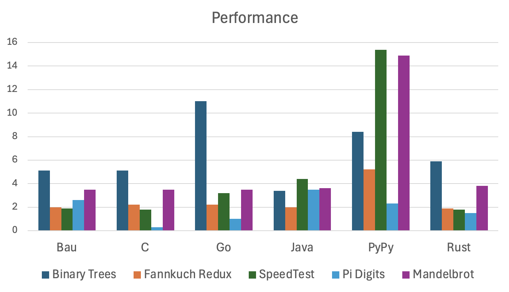

# Performance and Efficiency

Performance and efficiency have multiple aspects: ease of learning and usage
(developer productivity), compilation speed, startup time, runtime performance, and memory usage.

This language transpiles to C, which has a highly optimized toolchain, 
and is available for embedded systems, desktops, and servers.
Startup time is significantly faster than that of virtual machine-based languages like Java or C#,
as there is no VM or runtime to initialize.
Runtime performance: this language aims to be in the same category as 
high-performance languages such as C, Rust, Go, Java, and Swift.
To ensure low memory usage and to avoid GC pauses, 
it does not use tracing garbage collection.

Memory safety results in runtime overhead from reference counting and array bounds checking.
However, for performance-critical sections, this overhead can be mitigated:
The language supports ownership semantics for references, and range-restricted index variables,
so that the compiler can eliminate these checks where applicable.
The complexity of these features is however not needed in the majority of the cases,
which results in simple code and high productivity.

## Benchmarks

| Benchmark              |  Bau |   C  |  Go  | Java | PyPy | Rust | Swift|
|------------------------|------|------|------|------|------|------|------|
| Binary Trees           |  5.1 |  5.1 | 11.0 |  3.4 |  8.5 |  5.9 | 12.0 |
| Fannkuch               |  2.1 |  2.2 |  2.2 |  2.1 |  5.2 |  2.0 |  2.3 |
| SpeedTest              |  1.8 |  1.8 |  3.2 |  4.4 | 15.4 |  1.8 |  1.9 |
| Pi Digits              |  2.6 |  0.5 |  1.0 |  3.5 |  2.3 |  1.5 |  7.7 |
| Mandelbrot             |  3.5 |  3.5 |  3.5 |  3.8 | 14.9 |  3.8 | 17.0 |

(Runtime in seconds; lower is better. 
For Python, PyPy is used; CPython is around 50 times slower.
Measured on an Apple MacBook Pro M1.)

### Disclaimer

These benchmarks are not designed to show a language is "better" than another language.
Performance depends on many factors such as the algorithm used,
the developer, how much time is spend on optimizations, etc.
Also, measurements vary with hardware, compiler, or operating system.

Why then publish these benchmarks? 
Performance is an important aspect when selecting a programming language.
It is true that benchmarks are often used to mislead: cherry-picking,
comparing old version of competitors,
not specifying the details (compiler flags etc.).
However, not doing any benchmarks is not a solution either.
Computer science papers, for example, 
are often required to include benchmarks.
It is expected that performance is measured.
So it is a double-edged sword: many like to see benchmarks results,
but many will criticise the result - no matter how the benchmarks are done
or what the results show.
In the field of database engines, the "DeWitt Clause" is used,
which prevents people (competitors) from publishing benchmark results.
These clauses were included in licenses of databases because DeWitt, 
a researcher, conducted benchmark studies showed performance issues
in popular databases.
But for programming languages, 
very few (commercial) languages use such licenses.

Only a small number of benchmarks are implemented so far, 
most of them are based on the microbenchmarks from 
<a href="https://benchmarksgame-team.pages.debian.net/benchmarksgame/index.html">The Computer Language Benchmarks Game</a>.

For all languages, a very simple single-threaded implementation is used 
(without inline assembly etc.).
Memory usage  is not currently measured.
The tests are run 3 times, and the best time is used.
Benchmark results in seconds (lower is better).
For Java, memory is limited to 100 MB by using `-mx100m`, 
and the just-in-time compiler is pre-warmed
by running the same test 3 times inside the same JVM.

What this page tries to show is that, for these limited benchmarks, 
Bau has a similar performance then other popular programming languages, specially C.
Which makes sense, because it is transpiled to C.
It is sometimes slower, and sometimes faster, than Java, Go, and Rust.

#### Binary Trees

This test 
<a href="https://benchmarksgame-team.pages.debian.net/benchmarksgame/description/binarytrees.html#binarytrees">generates binary trees and counts the nodes</a>.
The Java version is very fast if given enough memory, because it doesn't collect garbage;
when limiting memory to 100 MB, it does collect garbage, but in a different thread.
For Bau, the ownership variant is used; the reference counted variant is a bit slower.
Bau includes a faster malloc implementation, which would brings performance close to Java.
The command line argument 20 is used instead of 21 as in the original test,
to speed up running the test; however the relative performance is unaffected.

#### Fannkuch

This test simulates
<a href="https://benchmarksgame-team.pages.debian.net/benchmarksgame/description/fannkuchredux.html#fannkuchredux">flipping pancakes</a>.
This test uses many array accesses. For Bau, no attempt was made to eliminate bound checks.
It unclear why the C version is a little bit slower then the C version created from Bau.
The command line argument 11 is used instead of 12 as in the original test,
to speed up running the test; however the relative performance is unaffected.

#### SpeedTest

This test is about the <a href="https://github.com/jabbalaci/SpeedTests">Münchausen numbers problem</a>.
This is a very fast loop with a lot of array access. 
(Standard) Python is particularly slow here because it is interpreted and doesn't use a JIT compiler.
The same settings are used as in the original benchmark.

#### Pi Digits

This uses a big integer library that computes
<a href="https://benchmarksgame-team.pages.debian.net/benchmarksgame/description/pidigits.html#pidigits">10'000 digits of Pi</a>.
Performance depends mostly on the big integer library.
The big integer library of Go, for example, is highly optimized, and using platform-specific assembly.
The Rust library is highly optimized as well, but the C "gmp" library is the fastest.
The Swift library "attaswift/BigInt" is used.
The Bau bigint library is around 400 lines of code, modelled after the Java library,
without platform-specific code.
Bau could easily use the "gmp" library as well.
The same settings are used as in the original benchmark.

#### Mandelbrot

This test computes the
<a href="https://benchmarksgame-team.pages.debian.net/benchmarksgame/description/mandelbrot.html#mandelbrot">Mandelbrot set</a>.
Only 8'000 by 8'000 pixels are calculated, versus 16'000 by 16'000 as in the original test,
to speed up running the test; however the relative performance is unaffected.
It is mostly testing floating point performance.

## Building and Running the Tests

Download and build the latest version:

    git clone git@github.com:thomasmueller/bau-lang.git
    cd bau-lang

Using Maven:

    mvn -DskipTests clean install

Using Make:

    make jar

Compiling and Running the C, Java, and Bau versions:

    rm -rf target/benchmarks
    mkdir -p target/benchmarks

    # Bau
    cp src/test/resources/org/bau/benchmarks/*.bau target/benchmarks
    for i in {1..2}; do time java -jar target/bau.jar -O3 -useTmMalloc false target/benchmarks/*.bau; done
    for i in {1..3}; do time target/benchmarks/binaryTrees 20; done
    for i in {1..3}; do time target/benchmarks/binaryTreesRefCount 20; done
    for i in {1..3}; do time target/benchmarks/fannkuch 11; done
    for i in {1..3}; do time target/benchmarks/munchausen; done
    for i in {1..3}; do time target/benchmarks/piDigits > out.txt; done
    for i in {1..3}; do time target/benchmarks/mandelbrot 8000 > out.tiff; done
    java -jar target/bau.jar -useTmMalloc true -O3 target/benchmarks/*.bau
    for i in {1..3}; do time target/benchmarks/binaryTrees 20; done
    for i in {1..3}; do time target/benchmarks/binaryTreesRefCount 20; done

    # C
    cp src/test/resources/org/bau/benchmarks/*.c target/benchmarks
    for i in {1..2}; do time (
        gcc -O3 target/benchmarks/binaryTrees.c -o target/benchmarks/binaryTrees
        gcc -O3 target/benchmarks/fannkuch.c -o target/benchmarks/fannkuch
        gcc -O3 target/benchmarks/munchausen.c -o target/benchmarks/munchausen
        gcc -O3 target/benchmarks/piDigits.c -o target/benchmarks/piDigits -I/opt/homebrew/include -L/opt/homebrew/lib -lgmp
        gcc -O3 target/benchmarks/mandelbrot.c -o target/benchmarks/mandelbrot
    ); done
    for i in {1..3}; do time target/benchmarks/binaryTrees 20; done
    for i in {1..3}; do time target/benchmarks/fannkuch 11; done
    for i in {1..3}; do time target/benchmarks/munchausen; done
    for i in {1..3}; do time target/benchmarks/piDigits 10000 > out.txt; done
    for i in {1..3}; do time target/benchmarks/mandelbrot 8000 > out.tiff; done

    # Go
    cp src/test/resources/org/bau/benchmarks/*.go target/benchmarks
    for i in {1..2}; do time (
        go build -ldflags="-s -w" target/benchmarks/binaryTrees.go
        go build -ldflags="-s -w" target/benchmarks/fannkuch.go
        go build -ldflags="-s -w" target/benchmarks/munchausen.go
        go build -ldflags="-s -w" target/benchmarks/piDigits.go
        go build -ldflags="-s -w" target/benchmarks/mandelbrot.go
    ); done
    for i in {1..3}; do time ./binaryTrees 20; done
    for i in {1..3}; do time ./fannkuch 11; done
    for i in {1..3}; do time ./munchausen; done
    for i in {1..3}; do time ./piDigits > out.txt; done
    for i in {1..3}; do time ./mandelbrot 8000 > out.tiff; done

    # Java
    for i in {1..2}; do time javac src/test/java/org/bau/benchmarks/*.java -d target/benchmarks; done
    java -cp target/benchmarks -mx100m org.bau.benchmarks.Loop org.bau.benchmarks.BinaryTrees 20
    java -cp target/benchmarks -mx100m org.bau.benchmarks.Loop org.bau.benchmarks.Fannkuch 11
    java -cp target/benchmarks -mx100m org.bau.benchmarks.Loop org.bau.benchmarks.Munchausen
    java -cp target/benchmarks -mx100m org.bau.benchmarks.Loop org.bau.benchmarks.PiDigits 10000 | grep Run
    java -cp target/benchmarks -mx100m org.bau.benchmarks.Loop org.bau.benchmarks.Mandelbrot 8000 | grep -a Run
    for i in {1..3}; do time java -mx100m -cp target/benchmarks org.bau.benchmarks.BinaryTrees 20; done
    for i in {1..3}; do time java -mx100m -cp target/benchmarks org.bau.benchmarks.Fannkuch 11; done
    for i in {1..3}; do time java -mx100m -cp target/benchmarks org.bau.benchmarks.Munchausen; done
    for i in {1..3}; do time java -mx100m -cp target/benchmarks org.bau.benchmarks.PiDigits 10000 > out.txt; done
    for i in {1..3}; do time java -mx100m -cp target/benchmarks org.bau.benchmarks.Mandelbrot 8000 > out.tiff; done
    
    # PyPy
    for i in {1..3}; do time pypy3.10 src/test/resources/org/bau/benchmarks/binaryTrees.py 20; done
    for i in {1..3}; do time pypy3.10 src/test/resources/org/bau/benchmarks/fannkuch.py 11; done
    for i in {1..3}; do time pypy3.10 src/test/resources/org/bau/benchmarks/munchausen.py; done
    for i in {1..3}; do time pypy3.10 src/test/resources/org/bau/benchmarks/piDigits.py 10000 > out.txt; done
    for i in {1..3}; do time pypy3.10 src/test/resources/org/bau/benchmarks/mandelbrot.py 8000 > out.tiff; done
    
    # Rust
    cp src/test/resources/org/bau/benchmarks/*.rs target/benchmarks
    rm -rf target/benchmarks/rust
    mkdir -p target/benchmarks/rust
    cp -R src/test/resources/org/bau/benchmarks/rust target/benchmarks
    for i in {1..2}; do time (
        cd target/benchmarks/rust
        cargo build --release
        cd ../../..
        rustc -C opt-level=3 target/benchmarks/binaryTrees.rs
        rustc -C opt-level=3 target/benchmarks/fannkuch.rs
        rustc -C opt-level=3 target/benchmarks/munchausen.rs
        rustc -C opt-level=3 target/benchmarks/mandelbrot.rs
    ); done
    for i in {1..3}; do time ./binaryTrees 20; done
    for i in {1..3}; do time ./fannkuch 11; done
    for i in {1..3}; do time ./munchausen; done
    for i in {1..3}; do time target/benchmarks/rust/target/release/pi_digits > out.txt; done
    for i in {1..3}; do time ./mandelbrot 8000 > out.tiff; done

    # Python
    for i in {1..3}; do time python src/test/resources/org/bau/benchmarks/binaryTrees.py 20; done
    for i in {1..3}; do time python src/test/resources/org/bau/benchmarks/fannkuch.py 11; done
    for i in {1..3}; do time python src/test/resources/org/bau/benchmarks/piDigits.py 10000 > out.txt; done
    for i in {1..3}; do time python src/test/resources/org/bau/benchmarks/munchausen.py; done
    for i in {1..3}; do time python src/test/resources/org/bau/benchmarks/mandelbrot.py 8000 > out.tiff; done
    
    # Swift
    cp src/test/resources/org/bau/benchmarks/*.swift target/benchmarks
    mkdir -p target/benchmarks/swift
    cp -R src/test/resources/org/bau/benchmarks/swift target/benchmarks
    cd target/benchmarks/swift/piDigits
    swift build -c release
    cp .build/arm64-apple-macosx/release/piDigits ../..
    cd ../../../..
    swiftc -O target/benchmarks/binaryTrees.swift -o target/benchmarks/binaryTrees
    swiftc -O target/benchmarks/fannkuch.swift -o target/benchmarks/fannkuch
    swiftc -O target/benchmarks/munchausen.swift -o target/benchmarks/munchausen
    swiftc -O target/benchmarks/mandelbrot.swift -o target/benchmarks/mandelbrot
    for i in {1..3}; do time target/benchmarks/binaryTrees 20; done
    for i in {1..3}; do time target/benchmarks/fannkuch 11; done
    for i in {1..3}; do time target/benchmarks/munchausen; done
    for i in {1..3}; do time target/benchmarks/piDigits 10000 > out.txt; done
    for i in {1..3}; do time target/benchmarks/mandelbrot 8000 > out.tiff; done

