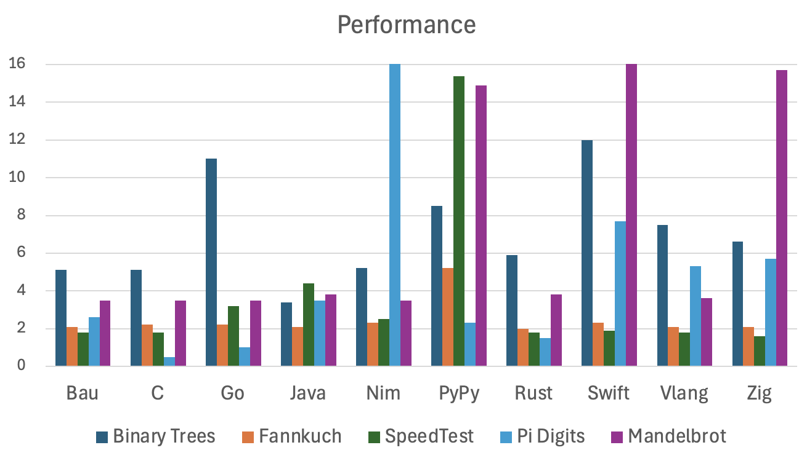

# Performance and Efficiency

Performance and efficiency have multiple aspects: ease of learning and usage
(developer productivity), compilation speed, startup time, runtime performance, and memory usage.

This language transpiles to C, which has a highly optimized toolchain, and is available
for embedded systems and server usage. This added step does slow down compilation a bit,
compared to pure C. Compilation is still much faster than with Rust.

Startup time is significantly faster than that of virtual machine-based languages like Java or C#, 
as there is no VM or runtime to initialize.

Runtime performance: this language aims to compete with high-performance languages
such as C, Rust, Go, Java, and Swift.
It avoids a tracing garbage collector, which results in low memory usage and eliminates GC pauses.

Memory safety results in runtime overhead from reference counting and array bounds checking.
However, for performance-critical sections, this overhead can be mitigated:
The language supports ownership semantics for references, and range-restricted index variables,
so that the compiler can eliminate these checks where applicable.
The complexity of these features is however not needed in the majority of the cases,
which results in simple code and high productivity.

## Benchmarks

Only a small number of benchmarks are implemented so far, most of them are based on
the microbenchmarks from <a href="https://benchmarksgame-team.pages.debian.net/benchmarksgame/index.html">The Computer Language Benchmarks Game</a>.

Most implementations are simple conversions of the original Java code.
For all languages, a very simple single-threaded implementation is used 
(without inline assembly etc.).
Memory usage  is not currently measured.
The tests are run 3 times, and the best time is used.
Benchmark results in seconds (lower is better; best of 3 runs).
For Java, memory is limited to 128 MB by using `-mx128m`, 
and the just-in-time compiler is pre-warmed 
by running the same test 3 times inside the same JVM 
(which is arguably not quite fair).

| Benchmark              |  Bau |   C  |  Go  | Java |Python| Rust |
|------------------------|------|------|------|------|------|------|
| Binary Trees           |  5.2 |  5.1 |  5.6 |  3.3 | 10.7 |  5.5 |
| Fannkuch Redux         |  1.9 |  1.9 |  2.2 |  2.3 |  9.7 |  1.9 |
| SpeedTest              |  1.8 |  1.8 |  3.2 |  4.4 |270.0 |  1.7 |
| Pi Digits              |  3.0 |  0.3 |  0.9 |  3.5 |  5.1 |  1.4 |
| Mandelbrot             | 14.1 | 14.1 | 13.7 |  9.5 |432.0 |  8.1 |
| Compilation            |  2.2 |  0.6 |  0.5 |  1.6 |  0.0 | 11.3 |

So in summary, for these benchmarks, Bau has a similar performance
then other popular programming languages, specially C.
Which makes sense, because it is transpiled to C.
It is sometimes slower, and sometimes faster than Java.
Compilation (including transpilation) is faster than with Rust.

### Binary Trees

This test generates a number of binary trees and counts the nodes.
The Java version is very fast if given enough memory, because it doesn't collect garbage;
when limiting memory to 128 MB, it i similar in speed than C.
For Bau, the ownership variant is used; the reference counted variant is a bit slower.

<a href="https://benchmarksgame-team.pages.debian.net/benchmarksgame/performance/binarytrees.html">Original</a>
 - <a href="../blob/src/test/java/org/bau/perf/benchmarksgame/BinaryTrees.java">Java</a>
 - <a href="../blob/src/test/resources/org/bau/benchmarksgame/binaryTrees.c">C</a>
 - <a href="../blob/src/test/resources/org/bau/perf/benchmarksgame/binaryTrees.bau">Bau (reference counting)</a>
 - <a href="../blob/src/test/resources/org/bau/perf/benchmarksgame/binaryTreesOwned.bau">Bau (ownership)</a>
 
### Fannkuch Redux

This test uses many array accesses. For Bau, no attempt was made to eliminate them.

* <a href="https://benchmarksgame-team.pages.debian.net/benchmarksgame/performance/fannkuchredux.html">Original</a>
* <a href="../blob/src/test/java/org/bau/perf/benchmarksgame/FannkuchRedux.java">Java</a>
* <a href="../blob/blob/src/test/resources/org/bau/benchmarksgame/fannkuch.c">C</a>
* <a href="../blob/src/test/resources/org/bau/perf/benchmarksgame/fannkuch.bau">Bau</a>

### SpeedTest

This test is about the <a href="https://github.com/jabbalaci/SpeedTests">Münchausen numbers problem</a>.
This is a very fast loop with a lot of array access. 
(Standard) Python is particularly slow here because it is interpreted and doesn't use a JIT compiler.

* <a href="https://github.com/jabbalaci/SpeedTests/blob/master/c/main.c">Original</a>
* <a href="../blob/src/test/java/org/bau/perf/speedtest/Munchausen.java">Java</a>
* <a href="../blob/src/test/java/org/bau/perf/speedtest/munchausen.c">C</a>
* <a href="../blob/src/test/java/org/bau/perf/speedtest/munchausen.bau">Bau</a>

### Pi Digits

This uses a big integer library that computes .
<a href="https://benchmarksgame-team.pages.debian.net/benchmarksgame/description/pidigits.html#pidigits">10'000 digits of Pi</a>.
Performance depends mostly on the big integer library.
The big integer library of Go, for example, is highly optimized, and using platform-specific assembly.
The Rust library is highly optimized as well, but the C "gmp" library is the fastest.
The Bau library is around 400 lines of code, modelled after the Java library,
without platform-specific code.
If Bau would use the "gmp" library, it would be as fast as C here.

* <a href="https://github.com/jabbalaci/SpeedTests/blob/master/c/main.c">Original</a>
* <a href="../blob/src/test/java/org/bau/perf/speedtest/Munchausen.java">Java</a>
* <a href="../blob/src/test/java/org/bau/perf/speedtest/munchausen.c">C</a>
* <a href="../blob/src/test/java/org/bau/perf/speedtest/munchausen.bau">Bau</a>

### Running the Test

Download and build the latest version:

    git clone git@github.com:thomasmueller/bau-lang.git
    cd bau-lang

Using Maven:

    mvn -DskipTests clean install

Using Make:

    make jar

Compiling and Running the C, Java, and Bau versions:

    mkdir -p target/benchmark
    mkdir -p target/benchmark/org/src/bau

    # Bau
    cp src/test/resources/org/bau/benchmarksgame/*.bau target/benchmark
    cp src/test/resources/org/bau/speedtest/*.bau target/benchmark
    time java -jar target/bau.jar target/benchmark/binaryTreesRefCount.bau
    time java -jar target/bau.jar target/benchmark/binaryTreesOwned.bau
    time java -jar target/bau.jar target/benchmark/fannkuch.bau
    time java -jar target/bau.jar target/benchmark/munchausen.bau
    time java -jar target/bau.jar target/benchmark/piDigits.bau
    time java -jar target/bau.jar target/benchmark/mandelbrot.bau
    time gcc -O3 target/benchmark/binaryTreesRefCount.c -o target/benchmark/binaryTreesRefCountBau
    time gcc -O3 target/benchmark/binaryTreesOwned.c -o target/benchmark/binaryTreesOwnedBau
    time gcc -O3 target/benchmark/fannkuch.c -o target/benchmark/fannkuchBau
    time gcc -O3 target/benchmark/munchausen.c -o target/benchmark/munchausenBau
    time gcc -O3 target/benchmark/piDigits.c -o target/benchmark/piDigitsBau
    time gcc -O3 target/benchmark/mandelbrot.c -o target/benchmark/mandelbrotBau
    for i in {1..3}; do time target/benchmark/binaryTreesRefCountBau 20; done
    for i in {1..3}; do time target/benchmark/binaryTreesOwnedBau 20; done
    for i in {1..3}; do time target/benchmark/fannkuchBau 11; done
    for i in {1..3}; do time target/benchmark/munchausenBau; done
    for i in {1..3}; do time target/benchmark/piDigitsBau > out.txt; done
    for i in {1..3}; do time target/benchmark/mandelbrotBau 16000 > out.tiff; done

    # C
    cp src/test/resources/org/bau/benchmarksgame/*.c target/benchmark
    cp src/test/resources/org/bau/speedtest/*.c target/benchmark
    time gcc -O3 target/benchmark/binaryTrees.c -o target/benchmark/binaryTreesC
    time gcc -O3 target/benchmark/fannkuch.c -o target/benchmark/fannkuchC
    time gcc -O3 target/benchmark/munchausen.c -o target/benchmark/munchausenC
    time gcc -O3 target/benchmark/piDigits.c -o target/benchmark/piDigitsC -I/opt/homebrew/include -L/opt/homebrew/lib -lgmp
    time gcc -O3 target/benchmark/mandelbrot.c -o target/benchmark/mandelbrotC
    for i in {1..3}; do time target/benchmark/binaryTreesC 20; done
    for i in {1..3}; do time target/benchmark/fannkuchC 11; done    
    for i in {1..3}; do time target/benchmark/munchausenC; done
    for i in {1..3}; do time target/benchmark/piDigitsC 10000 > out.txt; done
    for i in {1..3}; do time target/benchmark/mandelbrotC 16000 > out.tiff; done

    # Go
    time go build -ldflags="-s -w" src/test/resources/org/bau/benchmarksgame/piDigits.go
    time go build -ldflags="-s -w" src/test/resources/org/bau/benchmarksgame/binaryTrees.go
    time go build -ldflags="-s -w" src/test/resources/org/bau/speedtest/munchausen.go
    time go build -ldflags="-s -w" src/test/resources/org/bau/benchmarksgame/fannkuch.go
    time go build -ldflags="-s -w" src/test/resources/org/bau/benchmarksgame/mandelbrot.go
    for i in {1..3}; do time ./piDigits > out.txt; done
    for i in {1..3}; do time ./binaryTrees 20; done
    for i in {1..3}; do time ./munchausen; done
    for i in {1..3}; do time ./fannkuch 11; done
    for i in {1..3}; do time ./mandelbrot 16000 > out.tiff; done

    # Java
    time javac src/test/java/org/bau/perf/benchmarksgame/Loop.java -d target/benchmark    
    time javac src/test/java/org/bau/perf/benchmarksgame/BinaryTrees.java -d target/benchmark
    time javac src/test/java/org/bau/perf/benchmarksgame/FannkuchRedux.java -d target/benchmark
    time javac src/test/java/org/bau/perf/speedtest/Munchausen.java -d target/benchmark
    time javac src/test/java/org/bau/perf/benchmarksgame/PiDigits.java -d target/benchmark
    time javac src/test/java/org/bau/perf/benchmarksgame/Mandelbrot.java -d target/benchmark
    java -cp target/benchmark -mx128m org.bau.perf.benchmarksgame.Loop org.bau.perf.benchmarksgame.BinaryTrees 20
    java -cp target/benchmark -mx128m org.bau.perf.benchmarksgame.Loop org.bau.perf.benchmarksgame.FannkuchRedux 11
    java -cp target/benchmark -mx128m org.bau.perf.benchmarksgame.Loop org.bau.perf.speedtest.Munchausen
    java -cp target/benchmark -mx128m org.bau.perf.benchmarksgame.Loop org.bau.perf.benchmarksgame.PiDigits | grep time
    for i in {1..3}; do time java -mx128m -cp target/benchmark org.bau.perf.benchmarksgame.BinaryTrees 20; done
    for i in {1..3}; do time java -mx128m -cp target/benchmark org.bau.perf.benchmarksgame.FannkuchRedux 11; done
    for i in {1..3}; do time java -mx128m -cp target/benchmark org.bau.perf.speedtest.Munchausen; done
    for i in {1..3}; do time java -mx128m -cp target/benchmark org.bau.perf.benchmarksgame.PiDigits; done
    for i in {1..3}; do time java -mx128m -cp target/benchmark org.bau.perf.benchmarksgame.Mandelbrot 16000 > out.tiff; done
    
    # Python
    for i in {1..3}; do time python src/test/resources/org/bau/benchmarksgame/binaryTrees.py 20; done
    for i in {1..3}; do time python src/test/resources/org/bau/benchmarksgame/fannkuch.py 11; done
    for i in {1..3}; do time python src/test/resources/org/bau/benchmarksgame/piDigits.py 10000 > out.txt; done
    for i in {1..3}; do time python src/test/resources/org/bau/speedtest/munchausen.py; done
    for i in {1..3}; do time python src/test/resources/org/bau/benchmarksgame/mandelbrot.py 16000 > out.tiff; done
    
    # Rust
    mkdir -p target/benchmark/rust
    cp -R src/test/resources/org/bau/benchmarksgame/rust target/benchmark/rust
    cd target/benchmark/rust
    time cargo build --release
    cd ../../..
    cp src/test/resources/org/bau/speedtest/*.rs target/benchmark
    cp src/test/resources/org/bau/benchmarksgame/*.rs target/benchmark
    time rustc -C opt-level=3 -C lto=yes -C codegen-units=1 -C strip=symbols target/benchmark/binaryTrees.rs 
    time rustc -C opt-level=3 -C lto=yes -C codegen-units=1 -C strip=symbols target/benchmark/fannkuch.rs 
    time rustc -C opt-level=3 -C lto=yes -C codegen-units=1 -C strip=symbols target/benchmark/munchausen.rs 
    time rustc -C opt-level=3 -C lto=yes -C codegen-units=1 -C strip=symbols target/benchmark/mandelbrot.rs 
    for i in {1..3}; do time target/release/piDigits > out.txt; done
    for i in {1..3}; do time ./munchausen; done
    for i in {1..3}; do time ./fannkuch 11; done
    for i in {1..3}; do time ./mandelbrot 16000 > out.tiff; done
    for i in {1..3}; do time ./binaryTrees 20; done
    
