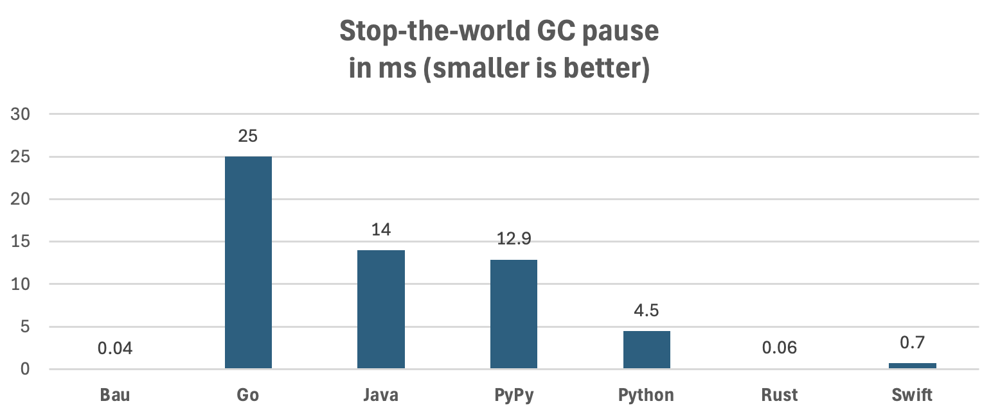

# Memory Management

In addition to being a very fast and user-friendly programming language, 
one of the highlights of this language is 
that it does not suffer from stop-the-world garbage collection pauses.

See below for details of the test setup.

## Memory Management Variants

Programming languages today mainly use the following strategies
to manage heap-allocated objects.
Each strategy has some advantages and disadvantages.
This is a simplification: some languages are hybrids and configurable 
(eg. Rust and C++ also offers reference counting); listed are only the defaults:

* Memory-unsafe manual memory management (C, C++, Zig).
  Runtime performance is great, but safety and manual work are concerns.
* Tracing garbage collection (Java, C#, JavaScript, Go, PyPy, Ruby).
  This is safe, and the most developer-friendly variant.
  But it uses more memory, suffers from (short) stop-the-world pauses, 
  and collection is non-deterministic.
* Reference counting (Bau, Swift, Objective-C, Nim, CPython).
  Typically uses less memory than tracing GC, 
  is deterministic and easy to use,
  but sometimes a bit slower than the alternatives.
* Memory-safe manual memory management via
  ownership and borrow checking (Rust).
  Uses little memory, runtime performance is great and deterministic.
  But it is harder to use, and ownership prevents cyclic data structures.

Bau uses reference counting by default;
for for performance-critical areas, an easy-to-use variant 
of ownership / borrowing is supported.
There are no stop-the-world GC pauses, and peak memory usage, 
compared to tracing garbage collection, is reduced.
Memory management is deterministic, and relatively easy to use.
Stack overflow during destruction is prevented for almost all cases.
There is no weak references and automatic cycle detection currently,
so that some manual work is needed to prevent cycles.

## Close Methods

If a type has a `close` function, then it is called
before the memory is freed.
It is not allowed to re-link the freed object in this method;
if this is done, then the program panics.

## Reference Counting Cycles

Reference counting can form cycles. As an example, 
an object can reference itself, 
in which case the reference count can not drop to zero,
even if the object is not referenced from anywhere else.
In this programming language,
currently such cycles are not detected or prevented.
It is the task of the developer to prevent them where needed.
To avoid cycles, explicitly set fields to `null`.

## Ownership

Where speed is critical, use single ownership,
by adding `+` to the type, and borrow with `&`.

    type Tree
        left Tree+?
        right Tree+?

    fun Tree+ nodeCount() int
        result := 1
        l : &left
        if l
            result += l.nodeCount()
        r : &right
        if r
            result += r.nodeCount()
        return result

In this case, reference counting is not used.
During borrowing, it is not allowed to call a method
that directly or indirectly de-allocates objects of the given type.

## Real-Time Memory Allocation

This language is transpiled to C.
Both reference counting as well as ownership use 
the `malloc` and `free` methods of the C standard library by default
to allocate and de-allocate objects on the heap.

However, an alternative O(1) `malloc` / `free` implementation
called "TmMalloc" is included,
which offers similar guarantees than the real-time memory allocation
library TLSF (<a href="https://github.com/mattconte/tlsf">Two-Level Segregated Fit</a>).
This further reduces worst-case delays on dynamic memory management.
Because it uses an allocation strategy that is similar to area allocation,
it is often faster than the default `malloc` / `free` implementations
(see benchmark results below).
To enable TmMalloc, use `-useTmMalloc true` when transpiling to C:

    java -jar bau.jar -useTmMalloc true -O3 *.bau

## Stack-Save Deallocation

Deallocation of one object can indirectly cause deallocation of a large number of nested objects.
One such example is a long linked list: if the head is deallocated,
indirectly all the linked entries are de-allocated as well.

Deep deallocation chains can cause stack overflow in some languages,
e.g Rust, unless if deallocation is implemented in code.
Stack overflow is not an issue in languages that use tracing garbage collection, 
eg. Java, Python, and Go.

This language uses the following approach to prevent stack overflow
for most cases: deallocation is recursive up to 2048 entries.
If there are more entries to be deallocated at once,
the objects to be deallocated are added to a stack instead.
Entries in this stack are processed in a loop instead of using recursion.
The deallocation stack size is 1024; 
if exhausted, deallocation switches back to recursion.
This approach prevents stack overflow in almost all cases:
both long linked lists as well as large array of references are supported.
Stack overflow is still possible with a combination, eg. large arrays
that reference long linked lists that itself point to arrays.
For such cases, either the configured values needs to be changed,
or the de-allocation needs to be done in code.

## Memory Management Tests

To understand the effects of memory management,
two benchmarks are included: the BinaryTrees benchmark
from "The Computer Language Benchmarks Game",
and the <a href="https://lemire.me/blog/2026/02/15/how-bad-can-python-stop-the-world-pauses-get/">
"Linked List" benchmark from Daniel Lemire</a>.
The linked list benchmark also measures stop-the-world garbage collection pauses
which are typical for tracing garbage collection, in the row "delay (ms)".

| Benchmark               |Bau RC|Bau |Bau RC TmMalloc|Bau TmMalloc|  Go|Java|PyPy|Python|Rust|Swift|
|-------------------------|-----:|---:|-----------------:|--------------:|---:|---:|---:|-----:|---:|----:|
| Binary Trees, seconds   |   4.9| 3.5|               2.7|            2.4| 6.8| 2.0| 5.5|  67.5| 4.1| 10.8|
| Linked List, seconds    |  18.7|13.6|              10.6|            8.3|22.1| 6.2| 8.3| 129.3|11.0| 39.0|
| Linked List, delay (ms) |   3.6| 0.6|              0.05|           0.04|25.0|14.0|12.9|   4.5|0.06|  0.7|

(Runtime in seconds, and worst-case delay in milliseconds.
Lower is better. Measured on an Apple MacBook Pro M4.)

For the linked list test, programming languages that use tracing GC (Go, Java, PyPy),
the maximum delay between runs is many milliseconds.

For Java, JDK 25 was used for testing. 
Pauses depend on the garbage collection algorithm used and the memory available.
The option `-XX:MaxGCPauseMillis=0` is not supported;
later values doesn't seem to have the desired effect.
The shortest pauses of around 1.5 ms were observed with `-Xmx4g -XX:+UseShenandoahGC`,
which is about twice the amount of memory used otherwise.

Both Bau and Rust and Bau have, when using the default `malloc` and `free` implementations,
also sometimes a delay of a few milliseconds.
When using a (near-) real-time `malloc` / `free`, the pauses are much shorter.

For Rust, the Linked List test would overflow the stack
when freeing the large linked list, because Rust recursively frees
(drops) objects. To avoid this stack overflow, an explicit
`drop` method needs to be implemented.
Bau does not need an explicit implementation.

## Building and Running the Tests

Download and build the latest version:

    git clone git@github.com:thomasmueller/bau-lang.git
    cd bau-lang

Using Maven:

    mvn -DskipTests clean install

Using Make:

    make jar

Compiling and Running the C, Java, and Bau versions:

    mkdir -p target
    cd target

    echo "== Bau ============"
    cp ../src/test/resources/org/bau/benchmarks/bau/* .
    find . -type f ! -name "*.?*" -delete
    java -jar bau.jar -O3 -useTmMalloc false *.bau
    for i in {1..3}; do time ./binaryTrees 20; done
    for i in {1..3}; do time ./binaryTreesRefCount 20; done
    for i in {1..10}; do time ./linkedList; done
    for i in {1..10}; do time ./linkedListRefCount; done
    java -jar bau.jar -useTmMalloc true -O3 *.bau
    for i in {1..3}; do time ./binaryTrees 20; done
    for i in {1..3}; do time ./binaryTreesRefCount 20; done
    for i in {1..10}; do time ./linkedList; done
    for i in {1..10}; do time ./linkedListRefCount; done

    echo "== Go ============"
    cp ../src/test/resources/org/bau/benchmarks/go/* .
    find . -type f ! -name "*.?*" -delete
    go build -ldflags="-s -w" binaryTrees.go
    go build -ldflags="-s -w" linkedList.go
    for i in {1..3}; do time GOMAXPROCS=1 GOMEMLIMIT=2GiB ./binaryTrees 20; done
    for i in {1..10}; do time GOMAXPROCS=1 GOMEMLIMIT=2GiB ./linkedList; done

    echo "== Java ============"
    javac ../src/test/java/org/bau/benchmarks/*.java -d .
    time java -Xmx100m org.bau.benchmarks.Loop org.bau.benchmarks.BinaryTrees 20
    time java -Xmx2g org.bau.benchmarks.Loop org.bau.benchmarks.LinkedList
    for i in {1..3}; do time java -Xmx100m org.bau.benchmarks.BinaryTrees 20; done
    for i in {1..10}; do time java -Xmx2g org.bau.benchmarks.LinkedList; done
    for i in {1..10}; do time java -Xmx2g -XX:+UseShenandoahGC org.bau.benchmarks.LinkedList; done
    
    echo "== Python via PyPy ============"
    cp ../src/test/resources/org/bau/benchmarks/python/* .
    for i in {1..3}; do time pypy3.10 binaryTrees.py 20; done
    for i in {1..10}; do time pypy3.10 linkedList.py; done
    
    echo "== Rust ============"
    cp ../src/test/resources/org/bau/benchmarks/rust/*.rs .
    find . -type f ! -name "*.?*" -delete
    rustc -C opt-level=3 binaryTrees.rs
    rustc -C opt-level=3 linkedList.rs
    for i in {1..3}; do time ./binaryTrees 20; done
    for i in {1..10}; do time ./linkedList; done
    
    echo "== Swift ============"
    cp ../src/test/resources/org/bau/benchmarks/swift/*.swift .
    find . -type f ! -name "*.?*" -delete
    swiftc -O binaryTrees.swift -o binaryTrees
    swiftc -O linkedList.swift -o linkedList
    for i in {1..3}; do time ./binaryTrees 20; done
    for i in {1..10}; do time ./linkedList; done

    echo "== Python (CPython) ============"
    cp ../src/test/resources/org/bau/benchmarks/python/* .
    for i in {1..3}; do time python3 binaryTrees.py 20; done
    for i in {1..10}; do time python3 linkedList.py; done
    
    cd ..
